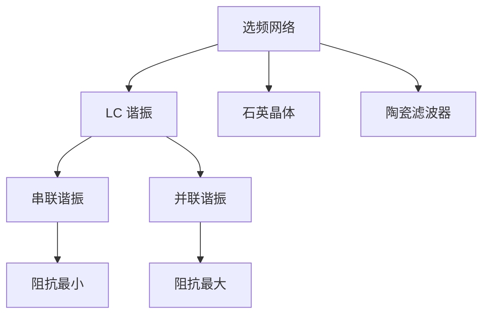
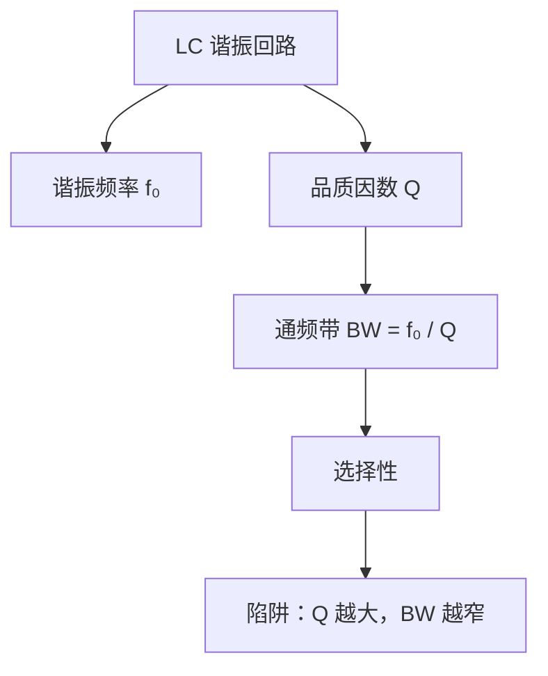
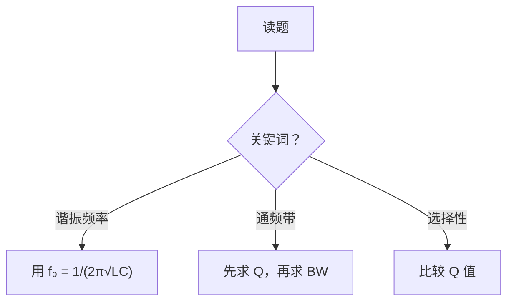

# Study Weaver

> A Claude Code skill that turns scattered course materials into structured, long-term study artifacts.
>
> 一个 Claude Code 技能，将零散的课程资料转化为结构化的长期学习成果。

---

## What is Study Weaver? / 这是什么？

Study Weaver is a customizable learning and exam-review skill for [Claude Code](https://claude.ai/code). It takes your slides, textbooks, homework, past papers, handwritten notes, and mistake records — and produces organized, readable Markdown notes with LaTeX formulas, Mermaid knowledge maps, question-trigger chains, and self-tests.

Study Weaver 是一个可定制的 Claude Code 学习与备考技能。它接收你的课件、教材、作业、真题、手写笔记、错题记录，生成结构清晰、可长期维护的 Markdown 笔记，内含 LaTeX 公式、Mermaid 知识地图、题型触发链和自测题。

**Core philosophy / 核心理念：**
- Markdown is the source of truth — editable, portable, durable / Markdown 是核心格式 — 可编辑、可移植、长期可用
- Understanding and scoring are not opposites / 理解与应试并不矛盾
- Knowledge should be connected, not just listed / 知识应该被连接，而不仅是罗列

---

## Features / 功能特性

### 4 Learning Modes / 四种学习模式

| Mode 模式 | When 适用场景 | Goal 目标 |
|-----------|--------------|-----------|
| **Semester-sync** 学期同步 | 学期进行中，每周有新内容 | Prevent knowledge gaps from accumulating / 防止知识断层累积 |
| **Deep-review** 高分精学 | 有充足时间，目标 85+/90+ | Build connected knowledge system and transfer ability / 构建知识网络，培养迁移能力 |
| **Exam-consolidation** 考前收束 | 学过一遍，临近考试 | Convert existing notes and mistakes into exam-ready structure / 将已有笔记和错题整合为考前复习结构 |
| **Survival-cram** 生存速通 | 时间紧迫，目标及格/75+ | Maximize score per hour / 每小时最大化得分 |

### Multi-format Output / 多格式输出

| Format 格式 | When to use 使用时机 | Note 说明 |
|-------------|---------------------|----------|
| **Markdown** | Default / 默认 | Source of truth, long-term editable / 核心格式，长期可编辑 |
| **HTML** | Want better reading view / 需要更好的阅读体验 | Stable formula rendering, visual maps / 公式渲染稳定，可视化地图 |
| **PDF** | Printing, mobile quick-ref / 打印、手机速看 | A4 sheets, exam-day reference / A4 打印版，考前速查 |
| **Anki CSV** | Long-term memorization / 长期记忆 | Formulas, definitions, traps / 公式、定义、易错判断题 |
| **Mermaid** | Knowledge maps / 知识地图 | Chapter maps, formula chains, question triggers / 章节地图、公式链、题型触发 |

### Handwritten Note Workflow / 手写笔记工作流

Accepts photos of handwritten notes, board writing, annotated slides, and scanned pages.

支持手写笔记照片、板书图片、批注课件、扫描件。

**Workflow / 工作流程：**
1. Identify note type (handwritten, board photo, annotated slide, etc.) / 识别笔记类型
2. Extract text, formulas, emphasis marks, diagrams / 提取文字、公式、强调标记、图表
3. Mark uncertain OCR (formulas, subscripts, Greek letters) / 标记 OCR 不确定项（公式、下标、希腊字母）
4. Align notes with textbook chapters and slides / 与教材章节和课件对齐
5. Produce extraction file and formula-check file / 生成提取文件和公式核对文件
6. Ask user to verify only high-risk items / 只要求用户核对高风险项

### Past-paper Reverse Engineering / 真题逆向工程

Don't just solve problems — extract the trigger pattern.

不只是解题 — 提取触发模式。

Each question gets / 每道题提取：
- **Trigger words** 关键词：wording that signals which method to use / 题目中指向特定解法的关键词
- **First reaction** 第一反应：what to do immediately upon reading / 读题后立即应做的操作
- **Standard chain** 标准链：step-by-step solving logic / 逐步解题逻辑
- **Score sources** 得分点：where marks come from / 给分来源
- **Breakpoints** 断链点：where students typically lose the chain / 学生通常在哪一步断链
- **Variations** 变体：how the question can be disguised / 同一题型的变形方式

### Mistake-driven Review / 错题驱动复习

When you keep making mistakes, Study Weaver switches to mistake-driven mode.

当你反复犯同一类错误时，Study Weaver 会切换到错题驱动模式。

**Mistake classification / 错误分类：**

| Type 类型 | Example 示例 |
|-----------|-------------|
| Concept misunderstanding 概念误解 | Confusing resonant frequency with cutoff frequency / 混淆谐振频率与截止频率 |
| Formula selection error 公式选用错误 | Using series formula for parallel circuit / 并联电路用了串联公式 |
| Condition error 条件错误 | Applying narrowband formula to broadband signal / 窄带公式用在宽带信号上 |
| Calculation error 计算错误 | Sign error, unit conversion / 符号错误、单位换算 |
| Question-reading error 审题错误 | Missing key constraint in problem statement / 漏看题目关键约束 |

For each mistake pattern, generates 2-3 **mutation drills** / 对每种错误模式生成 2-3 个变体训练题。

### Self-test System / 自测系统

Deep-review and semester-sync modes end each chapter with / 高分精学和学期同步模式每章结尾包含：

- 3 quick recall questions / 3 道快速回忆题
- 2 formula/application questions / 2 道公式应用题
- 1 connection question / 1 道知识连接题
- 1 mistake-prevention question / 1 道防错题

### Language Modes / 语言模式

| Mode 模式 | Description 描述 |
|-----------|-----------------|
| **Chinese** 中文 | Simplified Chinese explanations / 简体中文解释 |
| **English** 英文 | English explanations and terminology / 英文解释与术语 |
| **Bilingual** 双语 | Chinese body + English terms in parentheses / 中文正文 + 英文术语括注 |
| **Term-preserving** 术语保留 | Chinese body, English for formulas and variables / 中文正文，公式和变量保留英文 |

---

## Installation / 安装

### macOS

```bash
git clone https://github.com/meyumei/study-weaver.git ~/.claude/skills/study-weaver
```

### Linux

```bash
git clone https://github.com/meyumei/study-weaver.git ~/.claude/skills/study-weaver
```

### Windows (PowerShell)

```powershell
git clone https://github.com/meyumei/study-weaver.git "$env:USERPROFILE\.claude\skills\study-weaver"
```

### Windows (Git Bash)

```bash
git clone https://github.com/meyumei/study-weaver.git ~/.claude/skills/study-weaver
```

Restart Claude Code. The skill activates automatically when your prompt matches the triggers.

重启 Claude Code，当你的提问匹配触发词时技能自动激活。

---

## Usage / 使用方式

Just describe your study situation in natural language / 用自然语言描述你的学习情况即可：

**Semester-sync 学期同步：**
```
我这学期在学高频电子线路，每周都有课件和作业，帮我设计每周复习闭环
```
```
I'm studying RF circuits this semester, help me set up a weekly review workflow
```

**Deep-review 高分精学：**
```
帮我整理高频电子线路第2章选频网络，要知识地图、公式体系、题型调用链，冲90分
```
```
Review Chapter 2 frequency-selective networks with knowledge map and formula system, targeting 90+
```

**Exam-consolidation 考前收束：**
```
还有3天考高频电子线路，之前学过但很多忘了，帮我做个考前收束计划
```
```
3 days until my RF circuits exam, I studied but forgot a lot, help me consolidate
```

**Survival-cram 生存速通：**
```
明天就考通信原理了，基本没学，只有课件和两套真题，目标60分能过就行
```
```
Communications theory exam tomorrow, barely studied, just slides and two past papers, I just need to pass
```

**Handwritten notes 手写笔记：**
```
我有一堆手写笔记照片，里面有公式和老师强调点，帮我整理成复习资料
```
```
I have photos of handwritten notes with formulas and teacher emphasis, help me organize them
```

**English mode 英文模式：**
```
I want to review Chapter 4 oscillators in English with Mermaid diagrams and LaTeX formulas
```

---

## Personalization / 个性化配置

Create `study_profile.md` in your project root to customize behavior.

在项目根目录创建 `study_profile.md` 来定制行为。

```markdown
# Study Profile

## Language Mode
中文解释 + 英文术语括注

## Goal
冲 85+/90+，重视理解、题型迁移和错题回收。

## Learning Style
- 先看知识地图
- 再看公式体系
- 然后看题型调用链
- 最后做自测和错题回收
- 不喜欢超宽表格
- 喜欢 Mermaid 图和短段落

## Output Preference
- 默认生成 Markdown
- HTML 只在要求阅读版时生成
- PDF 只在要求打印版时生成
- Anki CSV 用于公式、定义、易错判断

## Review Rhythm
- 每周整理一次
- 考前 3 天生成收束计划
- 考前 30 分钟看最终压缩版

## Course Type
STEM calculation-heavy

## Special Rules
- 公式必须用 LaTeX
- 知识连接图优先 Mermaid
- 每章最后要有自测题
```

See full template in [SKILL.md](SKILL.md). / 完整模板见 SKILL.md。

---

## Knowledge Map Examples / 知识地图示例

Study Weaver generates layered knowledge maps using Mermaid / Study Weaver 使用 Mermaid 生成分层知识地图：

> **Note / 说明：** The Mermaid examples below use plain text for GitHub compatibility. In actual skill-generated Markdown files, formulas use LaTeX (e.g. `$f_0$`, `$\frac{1}{2\pi\sqrt{LC}}$`) and render correctly in editors that support LaTeX such as VS Code, Obsidian, Typora, etc.
>
> 以下 Mermaid 示例为适配 GitHub 使用纯文本。技能实际生成的 Markdown 文件中公式使用 LaTeX（如 `$f_0$`），在 VS Code、Obsidian、Typora 等支持 LaTeX 的编辑器中可正常渲染。

### Chapter Map 章节地图



### Formula Chain Map 公式链地图



### Question-trigger Map 题型触发地图



---

## Output Structure / 输出结构

```
progress/
├── weekly/                    # Semester-sync / 学期同步
│   ├── 第X周_学习闭环.md
│   ├── 第X周_公式卡片.md
│   └── 第X周_错题归因.md
├── deep_review/               # Deep-review / 高分精学
│   ├── [章节]_高分复习.md
│   ├── [章节]_公式体系.md
│   └── [章节]_题型调用链.md
├── exam/                      # Exam-consolidation / 考前收束
│   ├── 00_考前收束计划.md
│   ├── 高频题型重排.md
│   └── 考前30分钟速看.md
├── cram/                      # Survival-cram / 生存速通
│   ├── 00_生存大纲.md
│   ├── 高频公式与关键词.md
│   └── A4压缩.md
└── notes/                     # Handwritten notes / 手写笔记
    ├── 手写笔记_重点提取.md
    └── 手写笔记_公式核对表.md
```

---

## Supported Materials / 支持的资料格式

**Stable 可靠读取：**
`.md` `.txt` `.csv` `.json` `.yaml` `.pdf` (text) `.png` `.jpg` `.jpeg` `.webp` `.tex`

**Possible depending on environment / 视环境可能支持：**
`.docx` `.pptx` `.xlsx` image-heavy PDFs scanned PDFs with OCR

**Prefer conversion first / 建议先转换：**
`.doc` `.ppt` `.wps` `.ofd` encrypted PDFs low-quality scans

---

## File Structure / 文件结构

```
study-weaver/
├── SKILL.md          # Main skill definition / 主技能定义
├── evals/
│   └── evals.json    # Evaluation test cases / 评估测试用例
├── LICENSE           # MIT License
└── README.md         # This file / 本文件
```

---

## Customization for Fork / Fork 定制指南

This skill is designed to be forked and adapted for other learners.

本技能设计为可 fork 和定制，适配不同学习者。

1. Edit `SKILL.md` description for narrower/broader triggers / 修改 SKILL.md 的 description 调整触发范围
2. Use `study_profile.md` for learner preferences, not hardcoded / 学习偏好放 study_profile.md，不要硬编码
3. Course-specific examples only when teaching a general pattern / 课程特例只在示范通用模式时使用
4. Keep formulas in LaTeX, knowledge maps visual / 公式用 LaTeX，知识地图要可视化
5. Avoid overfitting to one university or exam format / 不要过度适配某一学校或考试

**Useful customization dimensions / 可定制维度：**

| Dimension 维度 | Options 选项 |
|----------------|-------------|
| Learning goal 学习目标 | pass / high-score / long-term mastery / research-depth |
| Learning style 学习风格 | visual-first / problem-first / formula-first / mistake-driven / memory-card-first |
| Language 语言 | Chinese / English / bilingual / term-preserving |
| Output 输出 | Markdown / HTML / PDF / Anki / Canvas |
| Course type 课程类型 | STEM / memorization / mixed / essay / lab |
| Review rhythm 复习节奏 | weekly / chapter-end / pre-exam / daily cram |

---

## Quality Bar / 质量标准

A good Study Weaver output should let the learner answer / 一份好的 Study Weaver 产出应该让学习者能回答：

- What should I study next? / 下一步该学什么？
- How do these concepts connect? / 这些概念之间如何关联？
- Which formulas matter and when do they apply? / 哪些公式重要，何时适用？
- What wording triggers which method? / 什么关键词触发什么方法？
- Where do I usually lose points? / 我通常在哪里丢分？
- Can I keep editing this as long-term notes? / 这份笔记能否长期维护？

---

## License

MIT
