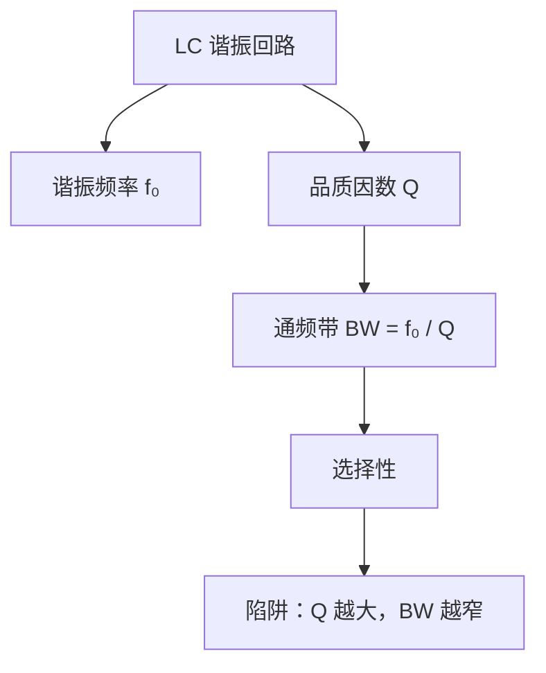

# Study Weaver

Study Weaver is a customizable university-course learning and exam-review skill.

It turns scattered course materials into structured, readable, long-term study artifacts: slides, textbooks, homework, past papers, handwritten notes, mistakes, teacher hints, and generated notes.

Default output is **Markdown source notes**. Optional outputs include HTML reading pages, PDF print sheets, Anki CSV cards, Mermaid diagrams, and visual knowledge maps when the user asks for them or when Markdown alone is not readable enough.

## What this skill is for

Use Study Weaver when:

- course materials are scattered across PDFs, PPTs, photos, homework, answers, and notes
- Markdown notes exist, but formulas do not render well or diagrams are not intuitive
- the user wants high-score understanding, not only last-minute cramming
- the user studied for a whole semester and wants to consolidate before an exam
- the user has handwritten notes and wants teacher emphasis, formulas, mistakes, and chapter links extracted
- the user wants a repeatable personal learning workflow customized to their study style

## Core ideas

- Markdown is the default source format because it is editable, portable, and durable.
- Markdown should still be readable: use clear hierarchy, LaTeX formulas, Mermaid diagrams, short paragraphs, and narrow tables.
- HTML is optional and should be suggested when the user wants a better reading view, stable formula rendering, or visual knowledge maps.
- Long-term learning and exam scoring are not opposites. Build understanding first when time allows; compress toward scoring behavior near the exam.
- Knowledge points should be connected into formula chains, question-trigger chains, prerequisite links, and mistake patterns.
- The skill is customizable. A learner study profile should guide language, style, output formats, and review rhythm.
- Do not promise true all-format reading. Use best-effort extraction plus conversion paths for difficult formats.

## Language modes

Infer the language mode from the user unless they specify one. If unclear, ask briefly or default to the user current language.

Supported modes:

1. **Chinese mode**: Simplified Chinese explanations. Best default for Chinese university exams.
2. **English mode**: English explanations and terminology.
3. **Bilingual mode**: Chinese explanations with English technical terms.
4. **Term-preserving mode**: Chinese body text, but formulas, variables, and important technical terms retain standard English names.

Recommended default for Chinese STEM courses:

```text
中文解释 + 英文术语括注 + LaTeX 公式
```

## Learning modes

Choose the smallest mode that matches the user situation. If the user has a `study_profile.md`, follow it first.

### 1. Semester-sync mode（学期同步）

Use when the user is learning the course throughout the semester.

Goal: prevent knowledge gaps from accumulating.

Typical outputs:

```text
progress/weekly/第X周_学习闭环.md
progress/weekly/第X周_公式卡片.md
progress/weekly/第X周_错题归因.md
progress/weekly/第X周_知识连接.md
```

Workflow:

1. Identify this week materials: slides, textbook sections, class notes, homework, lab, teacher hints.
2. Extract the week concepts, formulas, examples, and open questions.
3. Link them to previous weeks.
4. Generate self-tests and mistake-prevention notes.
5. If useful, generate Anki CSV cards for definitions, formulas, and traps.

### 2. Deep-review mode（高分精学）

Use when the user has enough time and wants 85+/90+ or durable understanding.

Goal: build a connected knowledge system and transfer ability.

Typical outputs:

```text
progress/deep_review/[章节]_高分复习.md
progress/deep_review/[章节]_公式体系.md
progress/deep_review/[章节]_题型调用链.md
progress/deep_review/[章节]_易错断链表.md
```

For each chapter, include reading guide, chapter knowledge map, LaTeX formula system, reasoning chain, typical problem models, trigger words, prerequisite links, mistake patterns, and self-test prompts.

### 3. Exam-consolidation mode（考前收束）

Use when the user has learned the course once and is approaching the exam.

Goal: convert existing knowledge, notes, and mistakes into exam-ready structure.

Typical outputs:

```text
progress/exam/00_考前收束计划.md
progress/exam/高频题型重排.md
progress/exam/易错点回收.md
progress/exam/终极公式体系.md
progress/exam/考前30分钟速看.md
```

### 5. Textbook-route mode（教材驱动规划）

Use when the user provides a textbook (PDF, table of contents photo, chapter list) and wants an automatic learning route and pacing plan based on the textbook structure.

Goal: generate a chapter-by-chapter learning sequence, time allocation, and milestone checkpoints from the textbook's table of contents.

Typical outputs:

```text
progress/route/00_教材分析.md          # TOC structure, chapter summaries, prerequisite links
progress/route/01_学习路线图.md        # Mermaid route map + chapter learning order
progress/route/02_节奏规划.md          # Daily/weekly schedule, milestones
progress/route/03_章节速查表.md        # Per-chapter core points, estimated time, difficulty rating
```

Workflow:

1. Read textbook table of contents:
   - If PDF: extract TOC page or use OCR on TOC photo
   - If photo: OCR and let user verify chapter titles
   - If user-pasted list: parse directly
   - If unclear: ask user to confirm chapter order

2. Identify chapter structure and prerequisite dependencies:
   - Use common STEM patterns (e.g., "Chapter 1 Introduction" → "Chapter 2 Basics" → "Chapter 3 Applications")
   - Suggest dependencies for user confirmation (e.g., "Chapter 4 uses formulas from Chapter 2 — should Chapter 2 come first?")
   - If no clear dependencies, default to linear order

3. Estimate time per chapter:
   - Base: 4 hours per chapter per week (user-configurable)
   - Adjust by difficulty: ★ (3h), ★★ (4h), ★★★ (6h)
   - Difficulty heuristics: chapter length, formula density, prerequisite count
   - Let user override any estimate

4. Generate learning route map:
   - Use Mermaid flowchart to show chapter dependencies
   - Use Unicode subscripts (f₀, Q, BW) — never LaTeX inside Mermaid nodes
   - Include legend: ★/★★/★★★ difficulty, estimated hours

5. Generate pacing plan:
   - If exam date provided: backward schedule from exam date
   - If no exam date: forward schedule from today
   - Daily/weekly breakdown with milestones (e.g., "Week 2: Chapters 1-3, milestone: understand resonance basics")
   - Include buffer days for review and catch-up

6. Generate chapter quick-reference sheet:
   - One-line summary per chapter
   - Core formulas (LaTeX in Markdown, not in Mermaid)
   - Prerequisites and post-requisites
   - Estimated time range (basic vs deep)

7. Optional integration with existing modes:
   - Each chapter in the route can trigger deep-review or exam-consolidation when the user reaches it
   - Link to progress/deep_review/[chapter]_高分复习.md when available

Key rules:

- Always use Mermaid with Unicode subscripts (f₀, Q, BW) — never LaTeX inside Mermaid nodes
- Difficulty ratings: ★ (basic), ★★ (moderate), ★★★ (advanced)
- Time estimates: provide ranges (e.g., 3-5h) and let user adjust
- If PDF TOC is readable, auto-extract; if photo, OCR then user verification
- When exam date is given, backward-schedule from exam day
- When no dependencies are clear, default to linear order
- Always let user override dependency suggestions and time estimates

Do not:
- Claim perfect TOC extraction — mark uncertain OCR and ask for verification
- Use LaTeX inside Mermaid — use Unicode subscripts instead
- Assume all chapters have dependencies — linear is a valid default
- Hardcode time per chapter — let user adjust based on their pace


## Personalization through study_profile.md

If a project contains `study_profile.md`, read and follow it before generating study artifacts.

If the user says “以后按我的学习方式来”, “帮我定制这个 skill”, “按我的习惯整理”, or similar, help create or update `study_profile.md`.

Suggested profile template:

```markdown
# Study Profile

## Language Mode
中文解释 + 英文术语括注

## Goal
冲 85+/90+，重视理解、题型迁移和错题回收。

## Learning Style
- 先看知识地图
- 再看公式体系
- 然后看题型调用链
- 最后做自测和错题回收
- 不喜欢超宽表格
- 喜欢 Mermaid 图和短段落

## Output Preference
- 默认生成 Markdown
- HTML 只在我要求阅读版/可视化版时生成
- PDF 只在我要求打印版时生成
- Anki CSV 用于公式、定义、易错判断

## Review Rhythm
- 每周整理一次
- 考前 3 天生成收束计划
- 考前 30 分钟看最终压缩版

## Course Type
STEM calculation-heavy / memorization-heavy / mixed / essay-heavy

## Special Rules
- 公式必须用 LaTeX
- 知识连接图优先 Mermaid
- 每章最后要有自测题
```

Keep customization outside the core skill when possible. Course-specific behavior belongs in the profile or examples, not hardcoded assumptions.

## Output format policy

### Default: Markdown source notes

Markdown is the default output because it is editable and works well as long-term source notes.

Make Markdown readable:

- Use LaTeX for all formulas: `$...$` for inline formulas and `$$...$$` for display formulas.
- Use Mermaid for knowledge maps and flowcharts when supported.
- Avoid very wide tables. Use tables only for compact comparison.
- Prefer headings, short paragraphs, bullet lists, callouts, formula blocks, and small diagrams.
- Start each major note with purpose, suitable use case, estimated reading time, and learning goal.
- Keep generated files in `progress/` when a course folder exists.

### Optional: HTML reading version

Offer HTML when Markdown is not intuitive, formulas do not render well, Mermaid diagrams do not display, or the user asks for a reading, web, or visual version.

HTML is a reading/export format, not the source of truth. Keep Markdown as the source unless the user says otherwise.

### Optional: PDF print version

Offer PDF when the user asks for printing, A4 sheets, stable mobile reading, or final exam-day quick reference. Do not make PDF the editable source.

### Optional: Anki CSV

Offer Anki CSV for semester-sync or long-term memorization, especially for formulas, definitions, common traps, fill-in facts, and judgment questions.

### Optional: Canvas / Excalidraw

Only suggest Obsidian Canvas or Excalidraw when the user explicitly wants a visual whiteboard-style artifact.

## Formula policy

Never output formulas as unrendered plain ASCII when LaTeX is appropriate.

Prefer:

```markdown
$$
f_0 = \frac{1}{2\pi\sqrt{LC}}
$$
```

Avoid:

```text
f0 = 1/(2pi sqrt(LC))
```

For important formulas include formula block, symbol meanings, units, applicable conditions, common traps, and typical question triggers.

## Knowledge-map policy

Knowledge maps must be visually useful. Do not rely only on large Markdown tables.

Use a layered structure:

1. **Chapter map**: concepts inside a chapter.
2. **Formula chain map**: how formulas depend on each other.
3. **Question-trigger map**: how wording leads to methods.
4. **Mistake-chain map**: where students usually break the chain.
5. **Integrated-problem map**: how multiple chapters connect in comprehensive questions.

Prefer Mermaid for readable maps. Do NOT use LaTeX (`$...$`) inside Mermaid nodes — Mermaid does not render LaTeX. Use Unicode subscripts (₀, ₁, ²) and plain text for formulas in diagrams. Put the full LaTeX version in the surrounding Markdown text instead.



Pair diagrams with a short explanation and a question-trigger chain.

## Handwritten-note workflow

Use this when the user provides handwritten notes, notebook photos, board photos, scanned pages, or screenshots.

Handwritten notes are valuable because they often contain teacher emphasis and personal mistakes, but formulas and symbols are error-prone under OCR.

Workflow:

1. Identify note type: handwritten page, board photo, annotated slide, solved example, mistake note.
2. Extract visible text, emphasized marks, diagrams, and formulas.
3. Mark uncertain OCR, especially formulas, subscripts, superscripts, Greek letters, and circuit symbols.
4. Align notes with the relevant chapter, slide, textbook section, or problem type.
5. Produce a concise extraction file and a formula-check file.
6. Ask the user to verify only high-risk formulas, not every sentence.

Suggested outputs:

```text
progress/notes/手写笔记_重点提取.md
progress/notes/手写笔记_公式核对表.md
progress/notes/手写笔记_老师强调点.md
progress/notes/手写笔记_与课件对齐.md
progress/notes/手写笔记_OCR疑点清单.md
```

## Material and file-format policy

Do not claim “all formats are supported.” Use best-effort handling and conversion guidance.

Usually stable:

- `.md`, `.txt`, `.csv`, `.json`, `.yaml`
- text-based `.pdf`
- clear `.png`, `.jpg`, `.jpeg`, `.webp` images
- `.tex` or exported Markdown/HTML notes

Often possible depending on environment:

- `.docx`
- `.pptx`
- `.xlsx`
- image-heavy PDFs
- scanned PDFs with OCR

Prefer conversion first:

- `.doc`, `.ppt`
- `.wps`
- `.ofd`
- encrypted PDFs
- very low-quality scans
- formula-heavy screenshots
- very large image collections

Recommended conversions:

```text
Word / WPS      -> DOCX / PDF / Markdown / TXT
PPT / PPTX      -> PDF or images per slide
Excel           -> XLSX / CSV
Scanned PDF     -> OCR PDF or page images
Old formats     -> modern Office formats or PDF
Formula images  -> image + manual formula verification
```

When extraction quality is uncertain, create an uncertainty list and ask the user to verify only the items that affect scoring or understanding.

## Material priority

When preparing for exams, prefer evidence in this order:

1. Teacher hints, final review slides, emphasized class examples.
2. Past papers with answer keys.
3. Homework, exercise sheets, and official answers.
4. Handwritten notes and personal mistake records.
5. Course slides and chapter summaries.
6. Textbook details.
7. External knowledge only as supplement.

When materials conflict, prefer teacher wording and answer-key scoring style.

## Problem and past-paper reverse engineering

When the user provides questions, homework, past papers, or answer keys, generate question-trigger chains rather than only solutions.

Include trigger words, first reaction, standard chain, score sources, breakpoints, variations, and high-score additions.

## Mistake-driven review

When the user has wrong answers or says they keep making mistakes, switch to mistake-driven review.

Classify mistakes as concept misunderstanding, formula selection error, condition error, calculation error, unit/sign error, question-reading error, missing keyword, or answer-structure error.

Then generate 2-3 mutation drills for the same mistake pattern.

## Self-test policy

For deep-review and semester-sync modes, end major notes with a short self-test:

- 3 quick recall questions
- 2 formula/application questions
- 1 connection question
- 1 mistake-prevention question

## Open-source and customization notes

This skill is intended to be readable and forkable.

When adapting Study Weaver for another learner:

1. Keep `name: study-weaver` unless publishing a separate variant.
2. Edit the description if your variant should trigger for narrower or broader situations.
3. Add learner-specific preferences to `study_profile.md` instead of hardcoding them in the skill.
4. Add course-specific examples only when they teach a general pattern.
5. Preserve the distinction between Markdown source notes and optional reading/export formats.
6. Keep formulas in LaTeX and knowledge maps visual.
7. Avoid overfitting to one university, one course, or one exam format.

Useful customization dimensions:

```text
Learning goal: pass / high-score / long-term mastery / research-depth
Learning style: visual-first / problem-first / formula-first / mistake-driven / memory-card-first
Language: Chinese / English / bilingual / term-preserving
Output: Markdown / HTML / PDF / Anki / Canvas
Course type: STEM / memorization / mixed / essay / lab
Review rhythm: weekly / chapter-end / pre-exam / daily cram
```

## Quality bar

A good Study Weaver output should let the learner answer:

- What should I study next, given my time and goal?
- How do these concepts connect?
- Which formulas matter, what do the symbols mean, and when do they apply?
- What wording in a problem tells me which method to use?
- Where do I usually lose points or misunderstand the chain?
- What should I review this week, before the exam, or in the final 30 minutes?
- Can I keep editing this Markdown as my long-term source note?

If the output is only a flat summary, improve it by adding structure, formulas, maps, triggers, or self-tests.

## Red lines

- Do not encourage academic dishonesty. A4 sheets mean legal study compression unless the user clearly states an allowed open-book or formula-sheet context.
- Do not pretend OCR or format extraction is perfect. Mark uncertain formulas and low-confidence recognition.
- Do not promise full-format support. Provide conversion paths.
- Do not generate unreadable Markdown full of wide tables and plain ASCII formulas.
- Do not produce only last-minute cram material when the user has time and wants high-score learning.
- Do not replace the learner own study style with one rigid workflow; use or create a profile.
